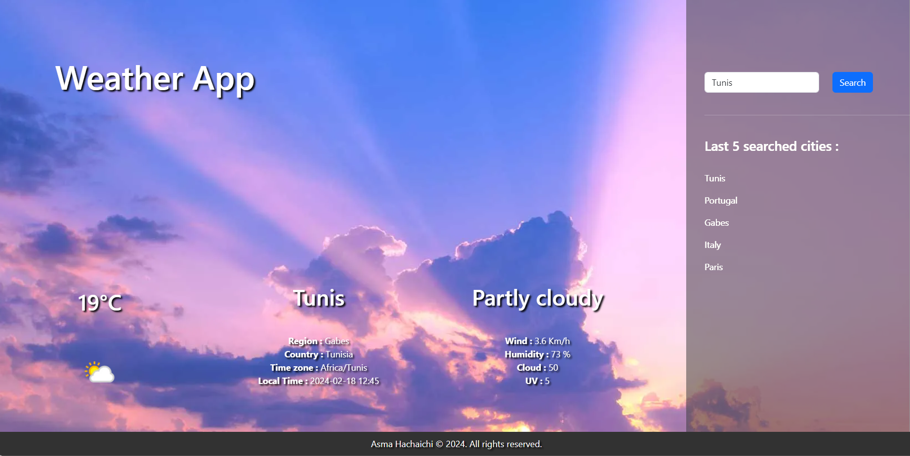

# Weather App

This Weather App is a user-friendly interface for checking the weather conditions in different cities around the world.

## Features

- Search for weather data by city and country.
- View current weather conditions including temperature, humidity, wind, and more.
- Displays an icon representing the weather condition.
- Maintains a list of the last 5 searched cities.

## API Used

The app fetches weather data from [WeatherAPI](https://www.weatherapi.com/). To use this app, you will need to sign up for your personal API key from WeatherAPI and add it to the application's configuration.

## Configuration

Before running the app, you need to set up your environment with your personal API key from WeatherAPI. Replace `YOUR_API_KEY` in the code with your actual API key. Note that the key should not be pushed to public repositories for security reasons.

```javascript
const key = "YOUR_API_KEY";
```

## Interface

Explore the intuitive interface and rich data visualizations of the dashboard. Below is a snapshot of the Weather App in action:



## License

This project is licensed under the MIT License - see the LICENSE file for details.

---

Feel free to contribute to the project by submitting pull requests or suggesting new features.

Asma Hachaichi © 2024. All rights reserved.
